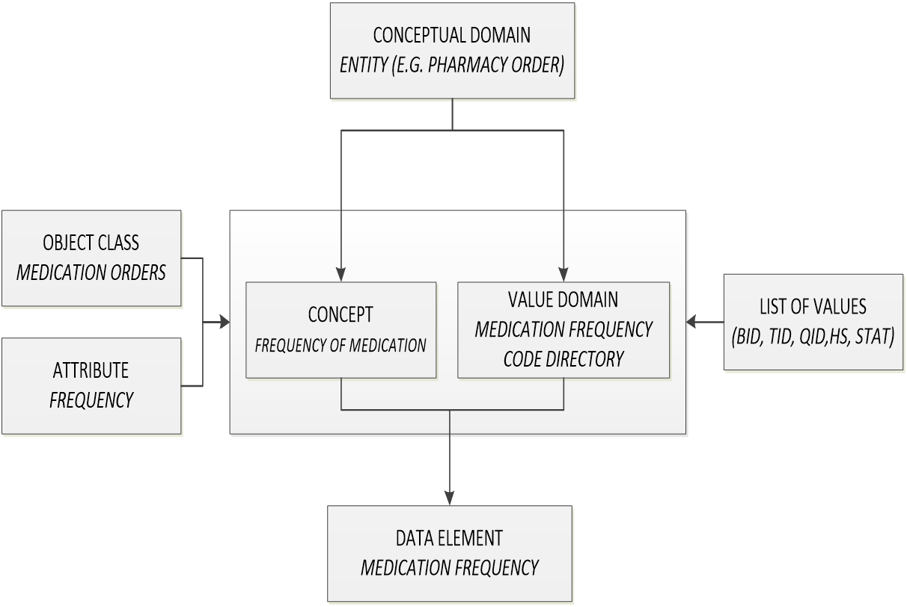

# Meta Data & Data Standards for Health Domain

Presently most of the e-Governance applications are operating in silos. For a successful e-Governance system, there is a need for seamless sharing and exchange of data among departmental applications. Semantic interoperability among e-Governance applications requires that precise meaning of exchanged information is understood across applications. There is a need for commonly accepted data definitions for the various elements used in Governance systems. Hence, standardization of data elements is the prerequisite for the systematic development of e-Governance applications.

The Health Domain MDDS Committee is an initiative, constituted on Sept 2012, under the chairmanship of Joint Secretary (Policy) with the senior technical officer of NIC as its member secretary. The secretariat is located in the National Health System Resource Centre (NHSRC), entrusted with the task of extensive stakeholder consultations and recruiting appropriate technical agencies to support this work. 

The adoption of Metadata and Data Standards across healthcare IT systems will enable easier, efficient exchange and processing of data. It will also remove ambiguities and inconsistencies in the use of data. Once the MDDS standards are adopted by all e-Governance applications in healthcare, the interoperability would be easier.  

**The importance of Inter-operability realized:**

### In Public Systems:
*   **To reduce workload in data recording and entry**
*   **To support decentralized, horizontally integrated decision making**
*   **To improve the quality and use of information**
*   **To allow the rapid growth of new systems and uses of IT**
### For Providers AND  Patients
*   **To improve the quality of care**
*   **To enable continuity of care**
### For Insurance Payers
*   **Access to patient records for claims settlements**

## Building Blocks of MDDS Health Domain

*   The health domain landscape are broadly divided into **_39 Entities_**. 
*   These entities are described and qualified with the help of **_1077 Data Elements_**.
*   Values of Data Elements are categorized under **_Data Elements (735), Values List (201) & Code Directories (141)_**
*   Meta Data are constructed to define **_each Data Element and Code Directory_** to establish Interoperability Standards
*   Interoperability Standards
*   Reference Architecture for Interoperability 

## DATA ELEMENTS

Defining Minimum Data Elements as standards is difficult in Health Domain. Minimum Data needs of the Primary Care Setting would be different from the Secondary and Tertiary Care Settings. The Health Domain MDDS Committee provides a list of data elements that will serve as the common data elements [CDE] for any new application being developed in Health domain.

Approximately 1000 data elements are identified for health domain and are grouped under logical entities such as Patient, Examination, Diagnosis, Mortality, Pharmacy etc. Grouping of data elements under these entities would make MDDS better manageable and easier to use. 

In case of certain data elements, the values and format are defined in advance and needs to be mandatorily used uniformly within/across domain applications. For such data elements, Code Directories are defined.

The basic principle of data modelling is the combination of an Object class and an Attribute to form a more specific ‘data element concept’. For example- the abstract concept ‘Frequency of Medication’ is combined with the object class ‘Medication Order’ and is associated with Attribute ‘Frequency’ to form the data element concept ‘Medication Frequency’.
 

The standard must select the most appropriate keyword as the representation of the concept. In the above case the Object: is ‘Medication Order’ and the Attribute: is ‘Frequency’

## CODE DIRECTORIES

CODE DIRECTORIES
Code directories are the standard value set defined by the MDDS committee that is recommended to be used for interoperability. 
In simple words, code directories are set of code datasets that are bounded to be used against a particular key-value or data elements. 

For Example- Value set of Health Service Provider Role Code directory 

|  Health Service Provider Role Code | Health Service Provider Role Name  |  
|----|----------------------|
| 01 | Primary Care Provider|
| 02 |Referring Provider|
| 03 |Treating Provider|
| 04 | Attending Provider|
| 05 |Admitting Provider|
| 06 |Consulting Provider|
| 07 |Ordering Provider|
| 08 |Dispensing Provider|
| 09 |Discharge Provider|
| 10 |Secondary Care Provider|
| 11 |Tertiary Care Provider|
| 12 |Transfusion Provider|
| 13 |Others

Till now MDDS was available in pdf format on but for the ease of use for the product and vendor community, we have made the 1000+ data elements and 144 code directories available in various formats like- CSV, JSON, ODS, XSD and XML. 
This will facilitate the following: 
Creation of Metadata Registry/Terminology Server
Use of XML for data transformation and validation of schemas
Publishing Master tables and Value sets
Creation of Restful API using master tables and value sets
Please note we have converted the MDDS- Health: Version 1 (http://egovstandards.gov.in/sites/default/files/Part%20I%20MDDS%20Overview%20Report_0.pdf) that was published by Department of Health & Family Welfare, Ministry of Health & Family Welfare (MoHFW), Government of India.  Whenever the ministry updates any element or code directory and releases a new version of the same, it can be updated by the custodian or managing authority. 

